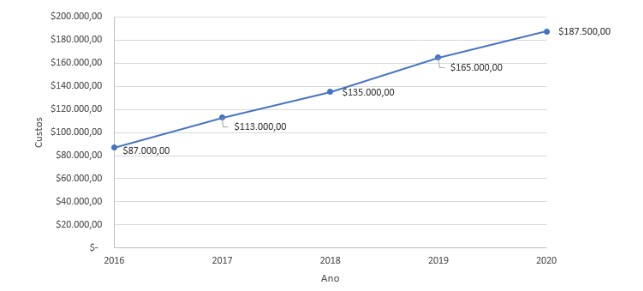
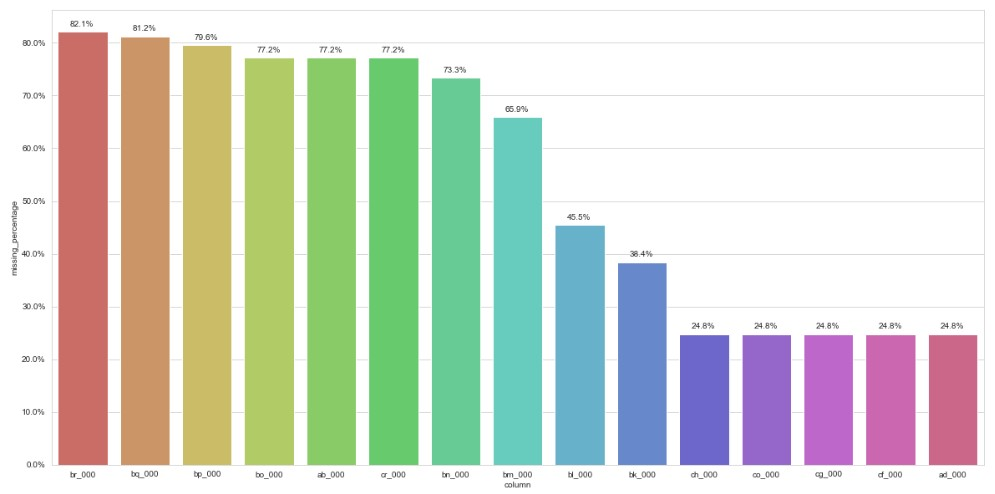

# Otimização do planejamento de manutenção

A empresa All-In Trucks conta uma frota média de caminhões para realizar entregas por todo país, porém nos últimos 3 anos vem percebendo um grande aumento nos gastos referentes à manutenção do sistema de ar de seus veículos, mesmo mantendo o tamanho de sua frota constante. O custo com manutenção deste sistema específico é mostrado abaixo em dólar:

# 1. Business Problem

* Objetivo principal: Diminuir os custos de manutenção do sistema de ar nos caminhões. 

- Os custos de manutenção para o sistema de ar podem variar de acordo com o real estado do caminhão. 
- Caso um caminhão seja mandado para manutenção, porém o mesmo não apresenta nenhum defeito neste sistema, será cobrado em torno de $10 pelo tempo gasto durante a vistoria pela equipe especializada. Porém, caso um caminhão com defeitos no sistema de ar não seja enviado diretamente para manutenção, a empresa desembolsa em $500 para realizar a manutenção corretiva do mesmo, considerando a mão de obra e a troca de peças. - A equipe técnica lhe informou que todas as informações referentes ao sistema de ar dos caminhos serão disponibilizadas para você, porém por motivos burocráticos todas as colunas precisavam ser codificadas.
- A equipe técnica também lhe informou que dado a recente digitalização da empresa, algumas informações podem estar ausentes da base de dados que lhe foi enviada. 
- A equipe técnica te informou que a fonte de informações advém do setor de manutenção da empresa, onde eles criaram uma coluna na base de dados chamada class: “pos” seriam aqueles caminhões que apresentavam defeitos no sistema de ar e “neg” seriam aqueles caminhões que apresentavam defeito em qualquer outro sistema que não fosse o de ar. 

# 2. Os Dados

A equipe técnica disponibilizou dois arquivos com as informações do setor de manutenção.

* data_pre_2020.csv: Arquivo contendo todas as informações do setor de manutenção dos anos anteriores a 2020. 
Arquivo com 60000 linhas e 171 colunas.

* data_2020.csv: Arquivo contendo todas as informações do setor de manutenção no ano de 2020. 
Arquivo com 16000 linhas e 171 colunas.

# 3. Estratégia de solução

**01. Data Description:**
O dataset inicial conta com 60000 linas e 171 colunas, algumas colunas com mais de 80% dos dados faltando.

Para tratar os dados faltantes eu eliminei as colunas com mais de 60% de dados faltantes e nas demais eu preenchi usando a média dos demais valores da coluna.

mesmo após eliminarmos algumas colunas, nosso dataset ainda tinha muita informação, para filtramos as colunas com maior relevância para um modelo de machine learning a esratégia foi treinar um modelo de árvore(Random Forest) e usarmos o método do modelo que nos informa as 20 features mais relavantes encontradas.

**02. Análise exploratória dos dados:**
Análise univariada e bivaria dos dados para identificarmos padrões nos dados. Nesta etapa conseguimos identificar que a maior das features possuiam um grande número de valores correspondentes a nenhuma falha, exceto a feature [cn_000].

[ay_005]: A maioria dos valores que indicam nenhuma falha são próximos de zero. Nesta feature, os valores mais altos consistem em ambas as classes.

[bj_000]: O valor mais alto indica falha. A maioria dos valores não indica falha.

[ay_006] Valores altos indicam tanto falha quanto não.

**03. Feature Engineering:**
A primeira ideia de feature engineering era reduzir a dimensionadidade do dataframe usando a Análise de componentes principais(PCA) porém tive algumas dificuldades na hora de aplicar a mesma redução nos dados de avaliação, portanto para o primeiro ciclo do projeto decidi ir somente com as 20 variáveis mais relevantes para o modelo.

**04. Machine Learning:**

Nos testes foram implementados os seguintes modelos de Machine Learning:

* Logistic Regression
* Random Forest
* XGBoost
* SVM

A métrica usada para avaliar o modelo foi a Macro-F1:

A macro F1 leva em consideração as pontuações da F1 de cada classe.
 A ideia é a métrica nos mostrar o desempenho do nosso modelo com base no número de pontos classificados corretamente para ambas as classes.
  Isso é útil porque o custo da classificação incorreta é muito alto, pois uma falha no sistema de ar que não é detectada pode levar à falha do caminhão durante a operação e aumentar o custo da manutenção.
  
  Fonte: <https://medium.com/@ramit.singh.pahwa/micro-macro-precision-recall-and-f-score-44439de1a044>

A variável target(class) estava altamente desbalanceada e foram gerados dados sintéticos usando a técnica de SMOTE equilibrando as classes para uma melhor generalização dos modelos de Machine Learning

O modelo escolhido foi o XGBoost pois ele obteve um bom valor de Macro-F1 após a validação cruzada.

** 05. Convertendo o desempenho do modelo em valores de negócios

Custo total: 10 * Falsos positivos(não apresentou defeitos) + $500 * Falsos negativos(Apresentou outros defeitos sem ser no sistema de ar)

Nos dados pré 2020 o nosso modelo reduziu o custo de manutenção para $12580, identificando 358 falsos negativos e 18 falsos positivos.

e nos dados de 2020 ele reduziu o custo de manutenção para 6820 identificando 232 casos de falso positivo e 9 de falso negativo.

# 04. Próximos passos:

* Criar novas features.
* Subir o modelo para a produção em nuvem.
* Criar uma aplicação web onde o time de manutenção consiga colocar os dados de manutenção da frota e seja devolvido os valores preditos para problema no ar ou não.

